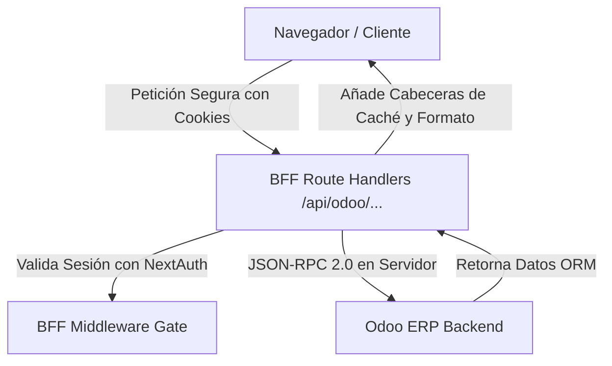

# Documentación del Proyecto: MasBordados Headless ERP (BFF & API)

Este documento detalla la arquitectura de servicios, la seguridad, los endpoints BFF (Backend-For-Frontend) y los tipos de datos en TypeScript del Headless ERP de **MasBordados**.

---

## 🏗️ Resumen de Arquitectura (BFF Pattern)

El frontend (Client Components) tiene **estrictamente prohibido comunicarse directamente con el servidor de Odoo** para prevenir la exposición de credenciales y API Keys de Odoo en el navegador.

Toda la comunicación de datos se realiza a través de un **BFF (Backend-For-Frontend)** implementado mediante **Next.js Route Handlers**:



---

## 🔒 Capa de Seguridad y Middleware

### 1. Middleware de Acceso (`middleware.ts`)
Toda ruta bajo `/dashboard` y `/api/odoo` está estrictamente protegida por NextAuth.js a nivel del Edge Runtime. Si un usuario no está autenticado, la petición es interceptada antes de llegar a los Route Handlers:
* **Petición de página (/dashboard)**: Redirecciona al usuario inmediatamente a `/login`.
* **Petición de API (/api/odoo/...)**: Intercepta y bloquea la petición, redireccionando de igual forma para evitar el leakage de endpoints internos.

### 2. Validación de Sesión en el BFF
Cada Route Handler realiza una validación secundaria redundante con `getServerSession(authOptions)` antes de procesar cualquier llamada:
```typescript
const session = await getServerSession(authOptions);
if (!session || !session.user) {
  return NextResponse.json({ success: false, error: "UNAUTHORIZED_BFF_CALL" }, { status: 401 });
}
```

---

## 🗂️ Catálogo de Endpoints del BFF

### 1. Autenticación ERP (NextAuth.js)
* **Endpoint**: `/api/auth/[...nextauth]`
* **Métodos**: `GET`, `POST`
* **Descripción**: Endpoint principal de NextAuth.js para iniciar/cerrar sesión de forma segura usando cookies `HttpOnly` y encriptación JWT.
* **Credenciales Locales Estáticas (Fase 1)**:
  * `admin` / `admin123!` (Rol: `admin`)
  * `operador` / `operator123!` (Rol: `operator`)

---

### 2. Server Ping & Estado de Conexión Odoo
* **Endpoint**: `/api/odoo/ping`
* **Método**: `GET`
* **Seguridad**: Requiere sesión de NextAuth activa.
* **Descripción**: Valida el estado de la comunicación server-to-server entre Next.js y el backend de Odoo.
* **Comportamiento Dual**:
  * **Modo Live**: Si `ODOO_URL` está configurado en `.env.local`, realiza una autenticación de credenciales real contra Odoo mediante JSON-RPC.
  * **Modo Mock**: Si `ODOO_URL` está vacío o es `"mock"`, simula una respuesta exitosa de Odoo v17.
* **Estructura de Respuesta (`200 OK`)**:
  ```json
  {
    "success": true,
    "status": "connected" | "mock_mode",
    "message": "Mensaje informativo de conexión...",
    "mode": "live" | "mock",
    "details": {
      "server_version": "17.0+e-mock",
      "server_serie": "17.0",
      "database": "nombre_de_bd",
      "username": "usuario_odoo",
      "timestamp": "2026-05-28T05:06:29.000Z"
    }
  }
  ```
* **Estructura de Respuesta de Error (`502 Bad Gateway` - Conexión de Odoo caída)**:
  ```json
  {
    "success": false,
    "status": "error",
    "message": "Error de comunicación Server-to-Server. No se pudo conectar a Odoo.",
    "mode": "live",
    "details": {
      "database": "nombre_de_bd",
      "username": "usuario_odoo",
      "timestamp": "2026-05-28T05:06:29.000Z"
    },
    "error": "Mensaje técnico del error de red o timeout"
  }
  ```

---

### 3. Catálogo SAT: Clave de Producto o Servicio
* **Endpoint**: `/api/odoo/sat/claveprodserv`
* **Método**: `GET`
* **Seguridad**: Requiere sesión de NextAuth activa.
* **Caché (Capa HTTP)**: `Cache-Control: public, max-age=3600, stale-while-revalidate=86400`
* **Descripción**: Obtiene del catálogo de Odoo (`sat.catalog.c_claveprodserv`) las claves autorizadas por el SAT para facturar productos y maquilas de costura.
* **Estructura de Respuesta (`200 OK`)**:
  ```json
  {
    "success": true,
    "catalog": [
      { "id": 1, "code": "82141502", "name": "Servicios de diseño de bordado de prendas" },
      { "id": 2, "code": "49121508", "name": "Hilos industriales para costura de alta resistencia" },
      { "id": 3, "code": "73151604", "name": "Servicio de maquila de bordado industrial" },
      { "id": 4, "code": "53101602", "name": "Camisas tipo polo listas para bordar" }
    ]
  }
  ```

---

### 4. Catálogo SAT: Uso de CFDI
* **Endpoint**: `/api/odoo/sat/usocfdi`
* **Método**: `GET`
* **Seguridad**: Requiere sesión de NextAuth activa.
* **Caché (Capa HTTP)**: `Cache-Control: public, max-age=3600, stale-while-revalidate=86400`
* **Descripción**: Recupera de Odoo el catálogo SAT de usos de CFDI autorizados (`sat.catalog.c_usocfdi`).
* **Estructura de Respuesta (`200 OK`)**:
  ```json
  {
    "success": true,
    "catalog": [
      { "id": 1, "code": "G01", "name": "Adquisición de mercancías" },
      { "id": 2, "code": "G03", "name": "Gastos en general" },
      { "id": 3, "code": "P01", "name": "Por definir" }
    ]
  }
  ```

---

## 💻 Tipos y Estructuras TypeScript (Data Model)

Toda la definición de interfaces core del Odoo Client y del BFF se ubican centralizadas en `types/odoo.d.ts`.

### 1. Tipos de Conexión Interna de Odoo (`types/odoo.d.ts`)
```typescript
// Configuración de credenciales cargadas desde .env.local en el Servidor
export interface OdooConfig {
  url: string;      // URL de Odoo sin slash al final
  db: string;       // Nombre de la base de datos
  username: string; // Nombre de usuario administrador o api-user
  apiKey: string;   // Contraseña o API Key de Odoo
}

// Estructura que retorna la firma del servidor Odoo
export interface OdooVersionResult {
  server_version: string;
  server_version_info: (string | number)[];
  server_serie: string;
  protocol_version: number;
}
```

### 2. Estructura de Intercambio del Protocolo JSON-RPC 2.0
El cliente `OdooClient` interactúa con el backend de Odoo mediante llamadas estrictas JSON-RPC sobre HTTP POST:
```typescript
// Petición saliente desde Next.js a Odoo
export interface OdooJsonRpcRequest<T = any> {
  jsonrpc: "2.0";
  method: "call";
  params: {
    service: "common" | "object";
    method: string;
    args: T;
  };
  id: number;
}

// Respuesta entrante desde Odoo a Next.js
export interface OdooJsonRpcResponse<T = any> {
  jsonrpc: "2.0";
  id: number;
  result?: T;
  error?: {
    code: number;
    message: string;
    data?: any;
  };
}
```

### 3. Tipos de Respuesta Unificadas del BFF
```typescript
// Payload unificado que entrega la API /api/odoo/ping al cliente web
export interface OdooPingResponse {
  success: boolean;
  status: "connected" | "mock_mode" | "error";
  message: string;
  mode: "live" | "mock";
  details?: {
    server_version?: string;
    server_serie?: string;
    database?: string;
    username?: string;
    timestamp: string;
  };
  error?: string; // Detalle del error de red o credencial si falla
}
```

---

## 🛠️ Estrategia de Caching de Odoo en Producción
Para evitar cuellos de botella en la base de datos de Odoo debido a la saturación de lecturas de catálogos estáticos, implementamos un esquema de **Caché en 2 niveles**:

1. **Nivel 1 (CDNs, Proxies y Navegador - Server Layer)**:
   * A través de la cabecera `stale-while-revalidate=86400` en los endpoints `/sat/...`, si un usuario solicita el catálogo y ha expirado la hora fresca, el servidor le entrega inmediatamente el caché obsoleto y descarga/actualiza el caché en background de forma asíncrona. La base de datos de Odoo solo recibe como máximo **1 petición al día** para estos datos estáticos.
2. **Nivel 2 (Client-Side con TanStack Query)**:
   * En el frontend de Next.js, configuramos un `staleTime` agresivo de **24 horas** para catálogos. La aplicación web del taller cargará los catálogos directo de la memoria RAM del navegador instantáneamente tras el primer fetching, logrando una navegación instantánea de 0ms para los operadores.

---

## 🛒 Tipos de Orden y Carrito (`types/order.d.ts`)

### Perfil de Cliente (Facturación)
```typescript
export interface CustomerProfile {
  name: string;      // Razón social o nombre completo
  rfc: string;       // RFC mexicano (12 o 13 caracteres)
  email: string;     // Correo electrónico
  zipCode: string;   // Código Postal (5 dígitos)
}
```

### Perfil de Prenda (Definición del producto físico)
```typescript
export interface GarmentProfile {
  garmentType: string;    // "Camisa de Vestir", "Polo", "Pantalón", etc.
  color: string;          // "Negro", "Blanco", "Azul Marino", etc.
  size: string;           // "S", "M", "L", "XL", "2XL", etc.
  claveProdServ: string;  // Código SAT del producto (ej: "53101602")
}
```

### Ítem del Carrito (Trabajo a realizar sobre una prenda)
```typescript
export interface OrderCartItem {
  id: string;               // UUID autogenerado (crypto.randomUUID)
  garment: GarmentProfile;  // Datos de la prenda física
  quantity: number;         // Cantidad de prendas a bordar
  designName: string;       // Nombre del ponchado / diseño
  usoCfdi: string;          // Código SAT Uso CFDI (ej: "G03")
  stitchCount?: number;     // Puntadas estimadas (opcional)
  threadColors?: string[];  // Colores de hilo en HSL o Hex
  notes?: string;           // Instrucciones del taller
}
```

### Store Completo (Zustand)
```typescript
export type OrderStore = {
  // Estado
  customer: CustomerProfile | null;
  items: OrderCartItem[];

  // Acciones
  setCustomer: (customer: CustomerProfile | null) => void;
  addItem: (item: Omit<OrderCartItem, "id">) => void;
  removeItem: (itemId: string) => void;
  updateItem: (itemId: string, updates: Partial<OrderCartItem>) => void;
  clearCart: () => void;
};
```

---

## 📦 Estado Global con Zustand (`store/useOrderStore.ts`)

El estado del carrito de órdenes se gestiona con **Zustand** y se persiste automáticamente en el `localStorage` del navegador bajo la clave `masbordados-order-store`.

### Características del Store
* **Persistencia Anticaídas**: Si hay un corte de luz o se cierra el navegador accidentalmente, al regresar todos los datos del cliente y las prendas en el carrito se restauran intactos.
* **UUID Seguro**: Cada prenda agregada recibe un ID único generado con `crypto.randomUUID()` (con fallback a timestamp+random para entornos sin soporte).
* **Protección contra Hydration Mismatch**: El hook auxiliar `hooks/useHydratedStore.ts` retrasa la lectura del `localStorage` hasta que el DOM del cliente se ha montado, evitando errores de hidratación en Next.js SSR.

---

## ✅ Esquemas de Validación Zod (Fase 5: Formularios)

### Validación de Cliente (`customerSchema`)
```typescript
const customerSchema = z.object({
  name: z.string().min(3, "El nombre debe tener al menos 3 caracteres"),
  rfc: z.string().regex(
    /^[A-ZÑ&]{3,4}[0-9]{6}[A-Z0-9]{3}$/,
    "RFC inválido. Formato: 3-4 letras + 6 dígitos + 3 alfanuméricos"
  ),
  email: z.string().email("Correo electrónico inválido"),
  zipCode: z.string().regex(/^[0-9]{5}$/, "C.P. debe ser de exactamente 5 dígitos"),
});
```

### Validación de Prenda (`garmentSchema`)
```typescript
const garmentSchema = z.object({
  garmentType: z.string().min(1, "Seleccione un tipo de prenda"),
  color: z.string().min(1, "Seleccione un color"),
  size: z.string().min(1, "Seleccione una talla"),
  claveProdServ: z.string().min(1, "Seleccione una clave de producto SAT"),
});
```

### Validación de Detalles del Pedido (`itemSchema`)
```typescript
const itemSchema = z.object({
  quantity: z.number().min(1, "La cantidad mínima es 1"),
  designName: z.string().min(2, "Nombre del diseño de ponchado requerido"),
  usoCfdi: z.string().min(1, "Seleccione un uso de CFDI"),
  notes: z.string().optional(),
});
```

---

## 🗺️ Mapa de Páginas y Navegación

| Ruta | Tipo | Descripción |
|---|---|---|
| `/` | Redirect | Redirige automáticamente a `/dashboard` |
| `/login` | Estática | Pantalla de inicio de sesión con validación Zod |
| `/dashboard` | Dinámica (Protegida) | Panel de control de producción con métricas |
| `/dashboard/nueva-orden` | Dinámica (Protegida) | Formulario transaccional de nueva orden de bordado |
| `/api/auth/[...nextauth]` | API | Endpoints de autenticación NextAuth.js |
| `/api/odoo/ping` | API (Protegida) | Validación de conexión server-to-server con Odoo |
| `/api/odoo/sat/claveprodserv` | API (Protegida) | Catálogo SAT de claves de producto/servicio |
| `/api/odoo/sat/usocfdi` | API (Protegida) | Catálogo SAT de usos de CFDI |
